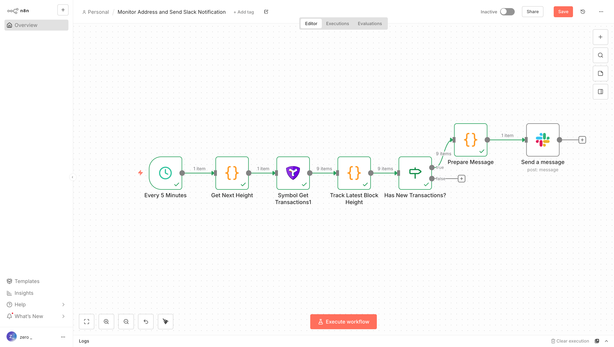

# n8n-nodes-symbol

n8n nodes for integrating with the Symbol blockchain.



## Prerequisites

**Node.js 20+** is required. Update if needed:

```bash
nvm install 20
nvm use 20
```

Then install n8n:

```bash
npm install n8n -g
```

## Installation

Clone this repository, then:

```bash
# Install dependencies and build
npm install
npm run build

# Package the node
npm pack

# Save the current path
PACKAGE_PATH=$(pwd)/n8n-nodes-symbol-0.1.0.tgz

# Install the package to n8n
mkdir -p ~/.n8n/nodes
cd ~/.n8n/nodes
npm install $PACKAGE_PATH

# Install n8n (if not already installed)
npm install n8n -g

# Start n8n
n8n start
```

## Use cases

Monitor Symbol blockchain addresses and trigger actions when transactions occur.
The node automatically handles pagination to retrieve all transactions for an address.

### Import example workflow

1. Open n8n in your browser (http://localhost:5678)
2. Click the three dots menu → **Import from File**
3. Select `examples/monitor-and-slack-notify.json`
4. Click on the Symbol get transactions node
5. When prompted, create a new Symbol API credential:
   - **Node URL**: Your Symbol node endpoint.
   - **Network Type**: Choose `testnet` or `mainnet`
6. Update the address field to monitor
7. Configure your Slack webhook or notification service
8. Toggle **Active** to start the workflow

The workflow monitors an address every 5 minutes and sends Slack notifications for new transactions.

## Development

```bash
npm run build      # Compile TypeScript
npm run lint       # Check code
npm run format     # Format code
```

## Resources

- [Symbol Documentation](https://docs.symboltest.net/)
- [n8n Community Nodes](https://docs.n8n.io/integrations/creating-nodes/)

## License

MIT
